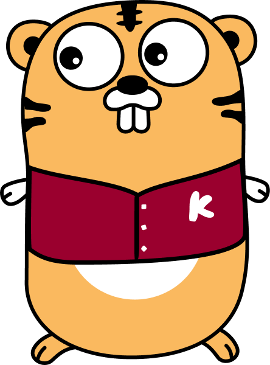

# The Ho Programming Language

***Ho*** is an open source programming language that makes it easy to build simple, reliable, and efficient software, ___as well as [Go](https://github.com/golang/go#the-go-programming-language)___.

<div align='center'>
  
</div>


## Character


<div align='center'>
  
  
</div>

**Hopher** is actually a gopher who is a student of [Korea University](https://www.korea.edu/mbshome/mbs/en/index.do) in South Korea. It loves Digging fields, eating pizza, and playing games.

## Grammer
변수
```
// 
어흥 호 밥먹었는지
어흥 랑 점심메뉴
어흥 이 가격

//
어흥 호호 동기들
어흥 랑랑 점심메뉴들
어흥 이이 가격들
```

```
크앙 밥먹었는지==참 ?
  ! 으르렁~ 점심메뉴
  !? 으르렁~ "아직 못먹음ㅠㅠ"
```

```
크릉 동기들 
  ! 으르렁~ "학식 먹었어?"
```

## History

- 20230403 1910 : start project


## Contributors ✨
<!-- ALL-CONTRIBUTORS-BADGE:START - Do not remove or modify this section -->
[](#contributors-)
<!-- ALL-CONTRIBUTORS-BADGE:END -->

<!-- ALL-CONTRIBUTORS-LIST:START - Do not remove or modify this section -->
<!-- prettier-ignore-start -->
<!-- markdownlint-disable -->
<table>
  <tbody>
    <tr>
      <td align="center" valign="top" width="14.28%">
        <a href="https://github.com/cstria0106">
          
          <br />
          <sub>
            <b>ziweek</b>
          </sub>
        </a>
      </td>
    </tr>
  </tbody>
</table>
